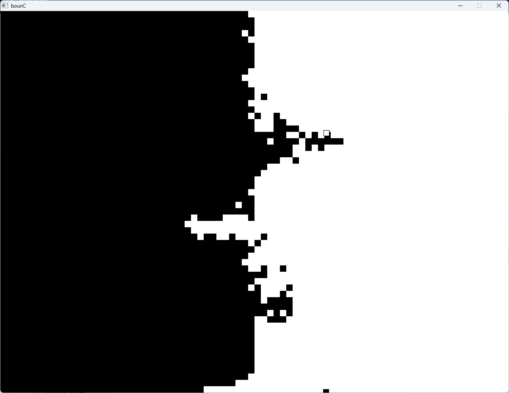
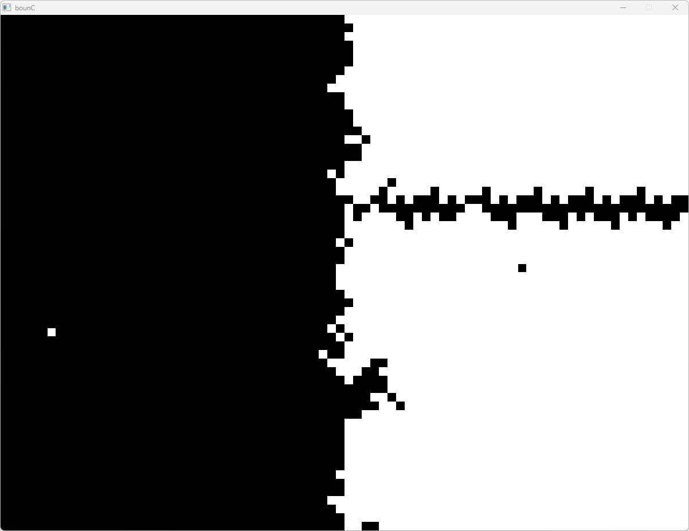
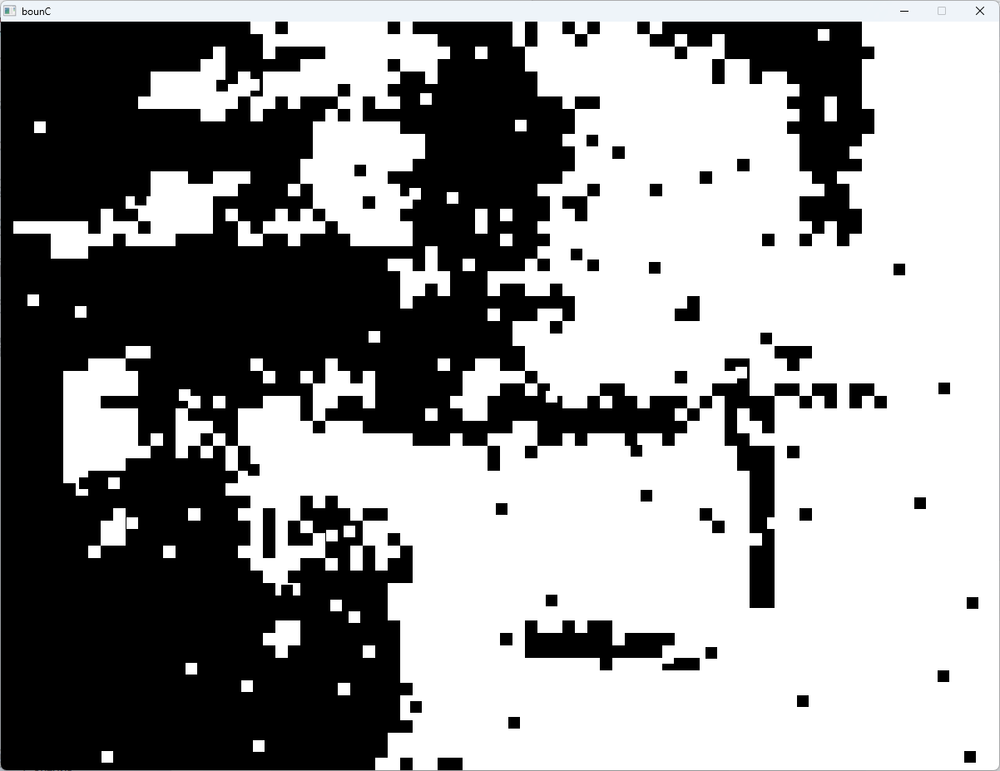
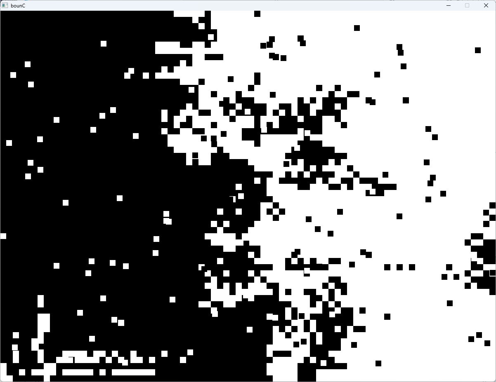

# bounC

A simple game where balls bounce and flip tiles. Developed in C as a study project exploring the Win32 API.

## Controls

- `N` - Add two new balls for each side. Things get really chaotic really fast.
- `R` - Reset

## Build

```bash
gcc boun.c -o bounce.exe -lgdi32 -lm
```
## Images





